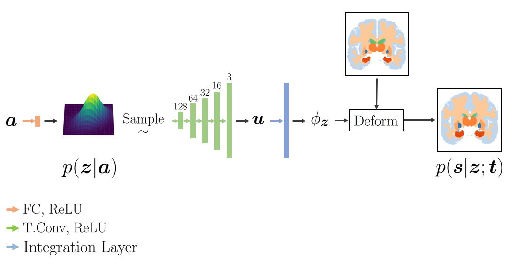

# Learning Conditional Deformable Shape Templates for Brain Anatomy

## Abstract
A brain template that describes the anatomical layout of an "average" brain is an essential building block of neuroimage analysis pipelines. However, a single template is often not sufficient to fully capture the variability in a heterogeneous population. Brain structures have very different shapes and sizes in different clinical and demographic groups. In this paper, we develop a novel neural network model that captures this morphometric variability. Our model learns to compute an attribute-specific spatial deformation that warps a brain template. We train this model on individual brain MRI segmentations in an end-to-end fashion, allowing for fast inference during testing. We demonstrate the ability of our model to deform a brain template given a wide range of ages, presence of disease and different sexes. Detailed qualitative and quantitative experiments are provided in order to demonstrate the flexibility of our model. Finally, we study the surface of the deformed template's hippocampus to show how our model can be used for shape analysis. 

## Requirements
The code was tested on:
- python 3.6
- pytorch 1.1
- torchvision 0.3.0
- scikit-image 0.16.2
- scikit-learn 0.19.1
- matplotlib 3.0.2
- numpy 1.15.4
- tqdm 4.38.0

## Instruction

### Prepocessing 
T1-weighted 3D brain MRI scans was preprocessed using FreeSurfer [1]. This includes skull stripping, bias-field correction, intensity normalization, affine registration to Talairach space, and resampling to 1 mm3 isotropic resolution. The original images had a shape of 256x256x256, which was futher cut using ((48, 48), (31, 33), (3, 29)) along the sides to elimate empty space. 

We provide some example OASIS [2] volumes in `./files/` with their respective segmentations. The labels legend can be found in the [FreeSurfer webpage](https://surfer.nmr.mgh.harvard.edu/fswiki/FsTutorial/AnatomicalROI/FreeSurferColorLUT). We also provide the probabilistic atlas that we used in the same folder. Check `functions/dataset.py` for further details on how we convert these numpy files into torch tensor. 

### Training
To train our network from scratch, run `python main.py 0 1 --use_dice`
The section `Load Data` and `Getting idx` should be customized for your dataset. We provide few preprocessed example in this code. 
The phenotype file `./files/phenotype.csv` should contain 3 columns (`M/F`, `Age` and `CDR`). CDR represent the presence of Alzheimer's (0-healthy, 1-Alzheimer's). 

### Evaluation
We provide a set of pretrained weights and a method to evaluate the model. Run `python eval_healthy_female_age_progression.py 0 ./files/weights.pth.tar`.  

This script deforms the template `./files/atlas.npz` as a function of age as a healthy female. The input attributes can be found in `./files/female_age_attribute.npy`. The first column is the sex (0-male, 1-female). The second column is the age and the last column is presence of disease (0-healthy, 1-Alzheimer's). 

The scipt outputs numpy files corresponding to the deformed template at different ages. Each numpy file is shaped `[1,n_regions,dim1,dim2,dim3]`, which represent the one-hot encoded deformed template with `n_regions` different brain regions. 

## Contact
Feel free to open an issue in github for any problems or questions.

## References
[1] Bruce Fischl. Freesurfer. Neuroimage, 62(2):774–781, 2012

[2] Marcus et al. Open access series of imaging studies (OASIS): cross-sectional MRI data
in young, middle aged, nondemented, and demented older adults. Journal of Cognitive
Neuroscience, 2007.
